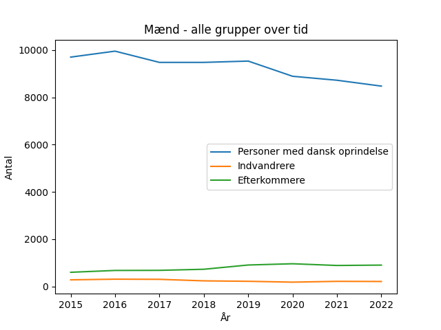
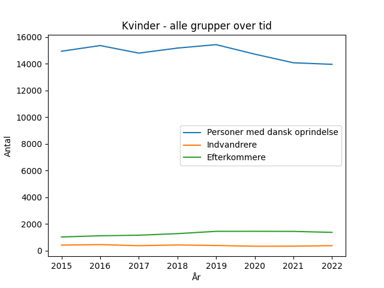
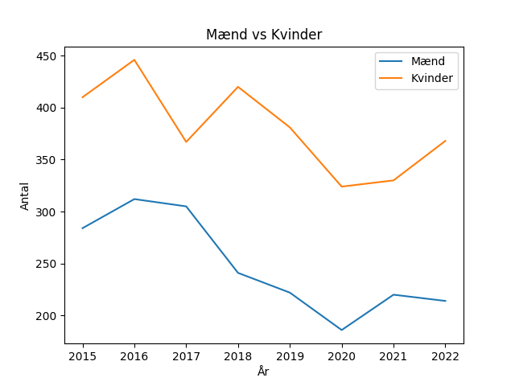

# Immigration Education Analysis

This project analyzes educational activity in Denmark based on data from Statistikbanken.

## Why this matters

Understanding changes in student composition can help policymakers and institutions better plan education and integration efforts.

## 📊 Dataset
The data comes from Statistics Denmark (DST) and includes:
- Educational activity in upper secondary education (gymnasiale uddannelser)
- Groups: 
  - Persons with Danish origin
  - Immigrants
  - Descendants
- Split by gender (men and women)
- Time period: 2015–2022

## 📁 Project Structure


ImmigrationEducation/
│
├── data/
│ ├── raw/ # Original CSV files
│ └── processed/ # Cleaned data
│
├── notebooks/
│ └── 01_data_overview.ipynb
│
├── outputs/ # Figures and results
├── src/ # Python scripts (future)
│
├── README.md
└── requirements.txt


## 🧹 Data Cleaning Steps

- Loaded raw CSV data from Statistikbanken
- Handled encoding issues (latin1)
- Selected relevant columns
- Renamed columns (years)
- Removed empty rows
- Added gender column
- Converted data from wide to long format using `pandas.melt()`

## 📈 Analysis

The dataset allows:
- Comparison between groups (Danish origin, immigrants, descendants)
- Comparison between genders
- Analysis of trends over time


## Results

### Men - all groups over time

### Women - all groups over time


### Immigrants - men vs women


## Insights
- Students with Danish origin show a declining trend over time  
- Descendants increase until around 2020 and then stabilize  
- Immigrants decrease until 2020, followed by a recovery  
- Trends are similar for men and women, but women have consistently higher numbers 


## Conclusion

This analysis shows a clear decline in students with Danish origin over time, while descendants have increased and immigrants show recovery after 2020.

The patterns are similar for men and women, suggesting that broader structural trends affect all groups.

Overall, the composition of students is gradually changing over time.

## ⚙️ Technologies

- Python
- Pandas
- Jupyter Notebook

## 🚀 How to run

1. Clone the repository
2. Install dependencies:

```bash
pip3 install -r requirements.txt
Open the notebook:
notebooks/01_data_overview.ipynb
📌 Author

Khalil Mashinesh
